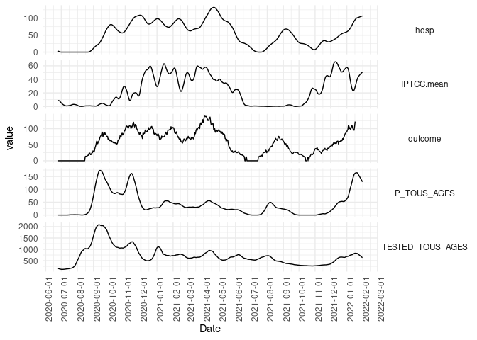

High dimension reservoir
================

<link href="results_high_dim_rc_files/libs/lightable-0.0.1/lightable.css" rel="stylesheet" />

# Setting

The total number of features is 409.

# Forecast

## Performance

<table class="table" style="margin-left: auto; margin-right: auto;">
<caption>Model performance</caption>
 <thead>
  <tr>
   <th style="text-align:left;"> model </th>
   <th style="text-align:left;"> update </th>
   <th style="text-align:right;"> AE </th>
   <th style="text-align:right;"> AE_baseline </th>
   <th style="text-align:right;"> RE </th>
   <th style="text-align:right;"> RE_baseline </th>
  </tr>
 </thead>
<tbody>
  <tr>
   <td style="text-align:left;"> Reservoir FS (GA) </td>
   <td style="text-align:left;"> No </td>
   <td style="text-align:right;"> 15.27 </td>
   <td style="text-align:right;"> -3.31 </td>
   <td style="text-align:right;"> 0.24 </td>
   <td style="text-align:right;"> 0.84 </td>
  </tr>
  <tr>
   <td style="text-align:left;"> Reservoir FS (GA) </td>
   <td style="text-align:left;"> Yes </td>
   <td style="text-align:right;"> 15.79 </td>
   <td style="text-align:right;"> -2.80 </td>
   <td style="text-align:right;"> 0.27 </td>
   <td style="text-align:right;"> 0.90 </td>
  </tr>
  <tr>
   <td style="text-align:left;"> Reservoir FS (GA) all anteriority </td>
   <td style="text-align:left;"> No </td>
   <td style="text-align:right;"> 15.71 </td>
   <td style="text-align:right;"> -2.88 </td>
   <td style="text-align:right;"> 0.28 </td>
   <td style="text-align:right;"> 0.86 </td>
  </tr>
  <tr>
   <td style="text-align:left;"> Reservoir FS (GA - PCA) </td>
   <td style="text-align:left;"> No </td>
   <td style="text-align:right;"> 15.59 </td>
   <td style="text-align:right;"> -3.00 </td>
   <td style="text-align:right;"> 0.28 </td>
   <td style="text-align:right;"> 0.87 </td>
  </tr>
  <tr>
   <td style="text-align:left;"> Reservoir FS (GA - PCA) </td>
   <td style="text-align:left;"> Yes </td>
   <td style="text-align:right;"> 15.63 </td>
   <td style="text-align:right;"> -2.95 </td>
   <td style="text-align:right;"> 0.29 </td>
   <td style="text-align:right;"> 0.85 </td>
  </tr>
  <tr>
   <td style="text-align:left;"> Reservoir FS (RS) </td>
   <td style="text-align:left;"> No </td>
   <td style="text-align:right;"> 18.45 </td>
   <td style="text-align:right;"> -0.14 </td>
   <td style="text-align:right;"> 0.36 </td>
   <td style="text-align:right;"> 1.00 </td>
  </tr>
  <tr>
   <td style="text-align:left;"> Reservoir FS (RS) </td>
   <td style="text-align:left;"> Yes </td>
   <td style="text-align:right;"> 17.81 </td>
   <td style="text-align:right;"> -0.77 </td>
   <td style="text-align:right;"> 0.31 </td>
   <td style="text-align:right;"> 0.98 </td>
  </tr>
  <tr>
   <td style="text-align:left;"> Reservoir no FS (GA) </td>
   <td style="text-align:left;"> No </td>
   <td style="text-align:right;"> 17.59 </td>
   <td style="text-align:right;"> -0.99 </td>
   <td style="text-align:right;"> 0.31 </td>
   <td style="text-align:right;"> 0.96 </td>
  </tr>
  <tr>
   <td style="text-align:left;"> Reservoir no FS (GA) </td>
   <td style="text-align:left;"> Yes </td>
   <td style="text-align:right;"> 16.95 </td>
   <td style="text-align:right;"> -1.64 </td>
   <td style="text-align:right;"> 0.29 </td>
   <td style="text-align:right;"> 0.97 </td>
  </tr>
  <tr>
   <td style="text-align:left;"> Elastic-net (RS) </td>
   <td style="text-align:left;"> No </td>
   <td style="text-align:right;"> 15.83 </td>
   <td style="text-align:right;"> -2.76 </td>
   <td style="text-align:right;"> 0.29 </td>
   <td style="text-align:right;"> 0.86 </td>
  </tr>
  <tr>
   <td style="text-align:left;"> Elastic-net (RS) </td>
   <td style="text-align:left;"> Yes </td>
   <td style="text-align:right;"> 16.22 </td>
   <td style="text-align:right;"> -2.36 </td>
   <td style="text-align:right;"> 0.30 </td>
   <td style="text-align:right;"> 0.88 </td>
  </tr>
  <tr>
   <td style="text-align:left;"> XGB (RS) </td>
   <td style="text-align:left;"> No </td>
   <td style="text-align:right;"> 15.45 </td>
   <td style="text-align:right;"> -3.14 </td>
   <td style="text-align:right;"> 0.28 </td>
   <td style="text-align:right;"> 0.81 </td>
  </tr>
  <tr>
   <td style="text-align:left;"> XGB (RS) </td>
   <td style="text-align:left;"> Yes </td>
   <td style="text-align:right;"> 16.32 </td>
   <td style="text-align:right;"> -2.27 </td>
   <td style="text-align:right;"> 0.29 </td>
   <td style="text-align:right;"> 0.89 </td>
  </tr>
  <tr>
   <td style="text-align:left;"> Reservoir FS (GA - 2000) </td>
   <td style="text-align:left;"> No </td>
   <td style="text-align:right;"> 14.66 </td>
   <td style="text-align:right;"> -3.92 </td>
   <td style="text-align:right;"> 0.25 </td>
   <td style="text-align:right;"> 0.83 </td>
  </tr>
</tbody>
</table>

## RC aggregation

## Graphical forecast

# Hyperparameters

## Numeric hyperparameters

## Categorical hyperparameters

    [[1]]
    NULL

    [[2]]
    NULL

    [[1]]
    NULL

    [[2]]
    NULL

## Ridge update of 2000 units reservoir

# Failure of monthly update

<table class="table" style="margin-left: auto; margin-right: auto;">
<caption>Performance by leaking rate</caption>
 <thead>
  <tr>
   <th style="text-align:left;"> model </th>
   <th style="text-align:left;"> update </th>
   <th style="text-align:left;"> leaking_rate </th>
   <th style="text-align:right;"> n </th>
   <th style="text-align:right;"> AE </th>
   <th style="text-align:right;"> AE_baseline </th>
   <th style="text-align:right;"> RE </th>
   <th style="text-align:right;"> RE_baseline </th>
  </tr>
 </thead>
<tbody>
  <tr>
   <td style="text-align:left;"> Reservoir FS (GA) </td>
   <td style="text-align:left;"> No </td>
   <td style="text-align:left;"> &lt; 1e-3 </td>
   <td style="text-align:right;"> 14 </td>
   <td style="text-align:right;"> 15.07126 </td>
   <td style="text-align:right;"> -3.515306 </td>
   <td style="text-align:right;"> 0.2580806 </td>
   <td style="text-align:right;"> 0.8247984 </td>
  </tr>
  <tr>
   <td style="text-align:left;"> Reservoir FS (GA) </td>
   <td style="text-align:left;"> No </td>
   <td style="text-align:left;"> &gt; 1e-3 </td>
   <td style="text-align:right;"> 26 </td>
   <td style="text-align:right;"> 15.51757 </td>
   <td style="text-align:right;"> -3.068987 </td>
   <td style="text-align:right;"> 0.2560384 </td>
   <td style="text-align:right;"> 0.8473388 </td>
  </tr>
</tbody>
</table>

# Computing time

# Reservoir vs raw features importance

# Number of parameters

<table class="table" style="margin-left: auto; margin-right: auto;">
<caption>Number of parameters</caption>
 <thead>
  <tr>
   <th style="text-align:left;"> model </th>
   <th style="text-align:right;"> min(nb_param) </th>
   <th style="text-align:right;"> max(nb_param) </th>
  </tr>
 </thead>
<tbody>
  <tr>
   <td style="text-align:left;"> RCGA </td>
   <td style="text-align:right;"> 682 </td>
   <td style="text-align:right;"> 725 </td>
  </tr>
  <tr>
   <td style="text-align:left;"> RCGAPCA </td>
   <td style="text-align:right;"> 508 </td>
   <td style="text-align:right;"> 711 </td>
  </tr>
  <tr>
   <td style="text-align:left;"> Enet </td>
   <td style="text-align:right;"> 394 </td>
   <td style="text-align:right;"> 394 </td>
  </tr>
  <tr>
   <td style="text-align:left;"> XGB </td>
   <td style="text-align:right;"> 12842 </td>
   <td style="text-align:right;"> 12842 </td>
  </tr>
</tbody>
</table>

<table class="table" style="margin-left: auto; margin-right: auto;">
<caption>Number of features</caption>
 <thead>
  <tr>
   <th style="text-align:left;"> model </th>
   <th style="text-align:right;"> q25 </th>
   <th style="text-align:right;"> q50 </th>
   <th style="text-align:right;"> q75 </th>
  </tr>
 </thead>
<tbody>
  <tr>
   <td style="text-align:left;"> RCGA </td>
   <td style="text-align:right;"> 191 </td>
   <td style="text-align:right;"> 197.0 </td>
   <td style="text-align:right;"> 204 </td>
  </tr>
  <tr>
   <td style="text-align:left;"> RCGAPCA </td>
   <td style="text-align:right;"> 12 </td>
   <td style="text-align:right;"> 14.0 </td>
   <td style="text-align:right;"> 18 </td>
  </tr>
  <tr>
   <td style="text-align:left;"> Enet </td>
   <td style="text-align:right;"> 228 </td>
   <td style="text-align:right;"> 233.0 </td>
   <td style="text-align:right;"> 236 </td>
  </tr>
  <tr>
   <td style="text-align:left;"> XGB </td>
   <td style="text-align:right;"> 392 </td>
   <td style="text-align:right;"> 393.5 </td>
   <td style="text-align:right;"> 396 </td>
  </tr>
</tbody>
</table>

# Performance by date update

## Confounding matrix

## Towards more agile update

<table class="table" style="margin-left: auto; margin-right: auto;">
<caption>Performance while selecting best hp sets among all of the best hp sets of very month. Results depending on the evaluation period</caption>
 <thead>
  <tr>
   <th style="text-align:right;"> Anteriority </th>
   <th style="text-align:right;"> MAE </th>
  </tr>
 </thead>
<tbody>
  <tr>
   <td style="text-align:right;"> 0 </td>
   <td style="text-align:right;"> 15.47284 </td>
  </tr>
  <tr>
   <td style="text-align:right;"> 1 </td>
   <td style="text-align:right;"> 15.47284 </td>
  </tr>
  <tr>
   <td style="text-align:right;"> 3 </td>
   <td style="text-align:right;"> 15.46620 </td>
  </tr>
  <tr>
   <td style="text-align:right;"> 7 </td>
   <td style="text-align:right;"> 15.61123 </td>
  </tr>
  <tr>
   <td style="text-align:right;"> 14 </td>
   <td style="text-align:right;"> 15.76887 </td>
  </tr>
  <tr>
   <td style="text-align:right;"> 28 </td>
   <td style="text-align:right;"> 15.74196 </td>
  </tr>
  <tr>
   <td style="text-align:right;"> Inf </td>
   <td style="text-align:right;"> 15.88550 </td>
  </tr>
</tbody>
</table>

